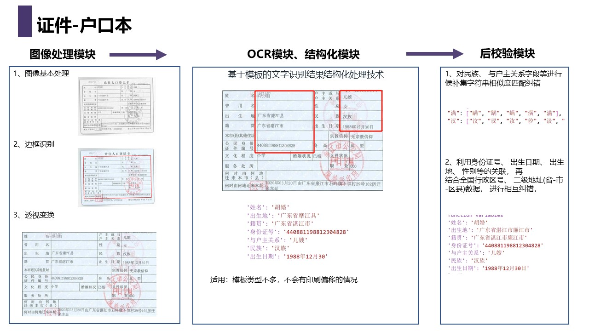
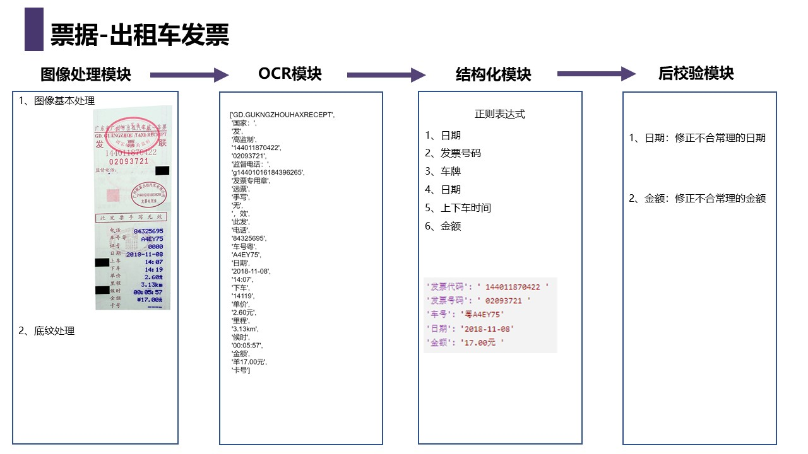
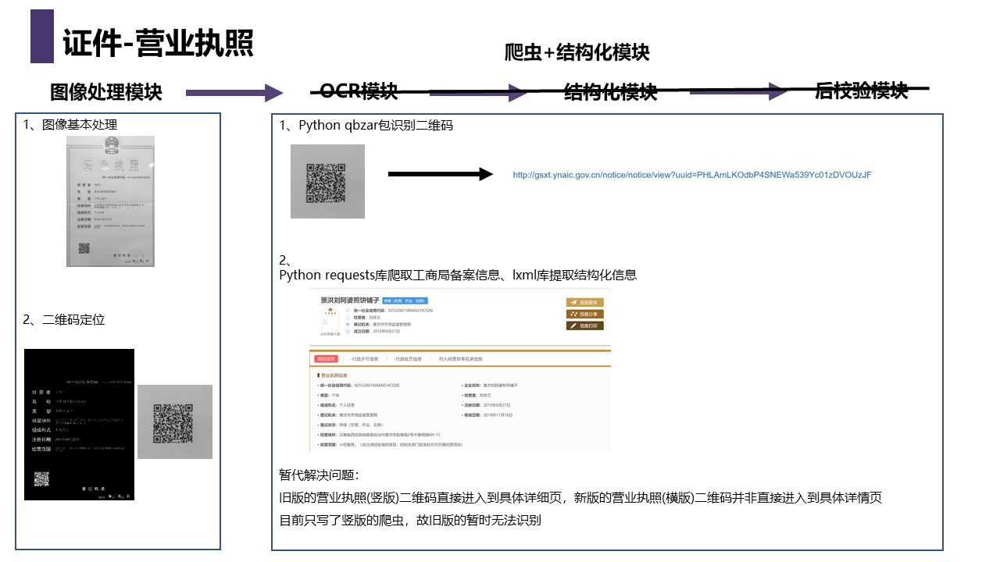

# 证件识别&发票识别
**目录结构**
- structured_process：结构化模块
- data_correction：后校验模块
- template：模板匹配用到的模板
- Interface：调用百度API的一些接口
- test_data：测试数据
- main：主函数  


>目前实现了出租车票据、户口本、营业执照三种类型的识别，逐渐完善各个模块ing  
调用方式如下：
```
import requests
import json
import cv2
import base64

url = "http://192.168.60.200:5555/OCR"
headers = {'content-type': 'application/x-www-form-urlencoded'}

# 二进制方式打开图片文件
f = open(r"/home/zhoujx/OCR/Identify_Cards/test_data/2/8.jpg", 'rb')
img_base64 = base64.b64encode(f.read())

# 如是出租车票据，category参数传0或taxi_receipt
# 如是营业执照，category参数传1或business_license
# 如是户口本，category参数传2或household_register
params = {'img_base64': img_base64, 'category':'2'}
response = requests.post(url, data=params, headers=headers)
result = response.json()
print(result)
```  


不同类型的识别逻辑如下图所示：




